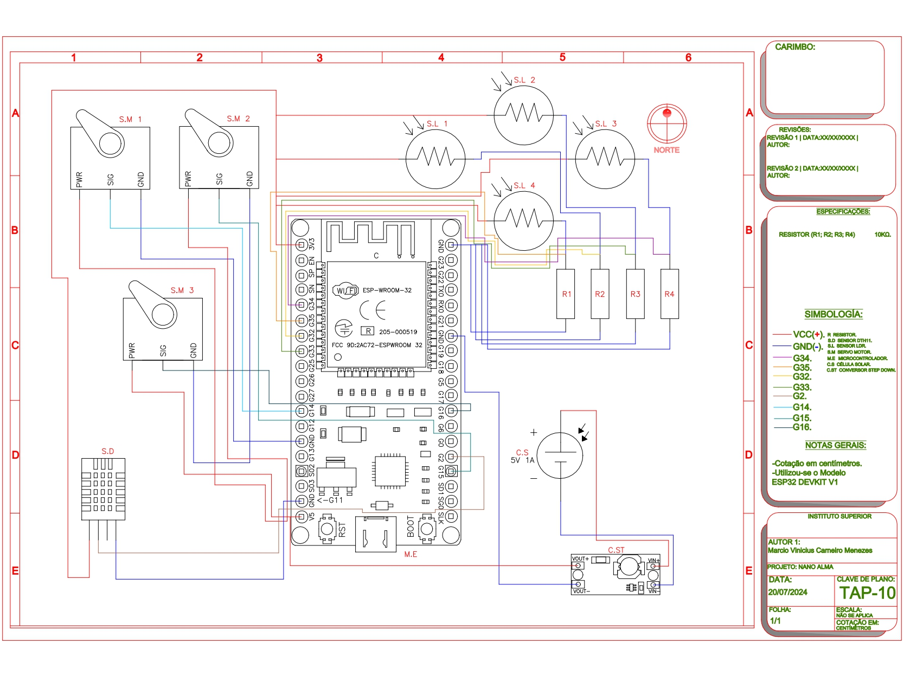

# 📡NANO_ALMA
                             
                             :7P#&@@@@&&#G5?!~
                             ~#@@@@@@@@@@@@@@@&#GJ!^
                       ~7    B@@@@@@@@@@@@@@@@@@@@@&B57^
                    ~Y#@#   :&@@@@@@@@@@@@@@@@@@@@@@@@@@BY!:  
                   ?@@@@&:   #@@@@@@@@@@@@@@@@@@@@@@@@@@@@@&P?^                     
                  ?@@@@@@?   J@@@@@@@@@@@@@@@@@@@@@@@@@@@@@@@@&G?^                 :?PBBPY^ 
                 ^&@@@@@@#:  :#@@@@@@@@@@@@@@@@@@@@@@@@@@@@@@@@@@&G?:             ^#@@@@@@&! 
                 5@@@@@@@@P   ~&@@@@@@@@@@@@@@@@@@@@@@@@@@@@@@@@@@@@&P!:          !@@@@@@@@J 
                :#@@@@@@@@@5   !@@@@@@@@@@@@@@@@@@@@@@@@@@@@@@@@@@@@@@@#Y~         ?#@@@@&Y
                ~@@@@@@@@@@@5   !&@@@@@@@@@@@@@@@@@@@@@@@@@@@@@@@@@@@@@@@@G7:        ~77~: 
                7@@@@@@@@@@@@P:  ^B@@@@@@@@@@@@@@@@@@@@@@@@@@@@@@@@@@@@@@@@B!           
                J@@@@@@@@@@@@@B^  :P@@@@@@@@@@@@@@@@@@@@@@@@@@@@@@@@@@@@BJ~
                J@@@@@@@@@@@@@@&7   ?&@@@@@@@@@@@@@@@@@@@@@@@@@@@@@@&GJ^        ?5~  
                7@@@@@@@@@@@@@@@@P:  ^G@@@@@@@@@@@@@@@@@@@@@@@@@@&G?^          5@@@G!
                !@@@@@@@@@@@@@@@@@#7   7#@@@@@@@@@@@@@@@@@@@@@&P7:           :G@@@@@@G!
                :&@@@@@@@@@@@@@@@@@@P^  :5@@@@@@@@@@@@@@@@@#5!:             ^#@@@@@@@@@P~  
                 G@@@@@@@@@@@@@@@@@@@&J   ~G@@@@@@@@@@@@#57                7&@@@@@@@@@@@@5^ 
                 7@@@@@@@@@@@@@@@@@@@@@#7   7B@@@@@@@@@P^                 J@@@@@@@@@@@@@@@&?
                  #@@@@@@@@@@@@@@@@@@@@@@G!   7B@@@@@@@@#J^              5@@@@@@@@@@@@@@@@@@B~ 
                  7@@@@@@@@@@@@@@@@@@@@@@@@G~   7G@@@@@@@@&5~          :G@@@@@@@@@@@@@@@@@@@@@Y
                   G@@@@@@@@@@@@@@@@@@@@@@@@@P~   !G@@@@@@@@@G!       ~#@@@@@@@@@@@@@@@@@@@@@@@#~ 
                   :&@@@@@@@@@@@@@@@@@@@@@@@@@@G!   ~P@@@@@@@@@BJ:   7@@@@@@@@@@@@@@@@@@@@@@@@@@@J
                    !@@@@@@@@@@@@@@@@@@@@@@@@@@@@B7   ^5&@@@@@@@@&5~Y@@@@@@@@@@@@@@@@@@@@@@@@@@@@@P: 
                     7@@@@@@@@@@@@@@@@@@@@@@@@@@@@@#J:  :JB@@@@@@@@@@@@@@@@@@@@@@@@@@@@@@@@@@@@@@@@B^ 
                      7@@@@@@@@@@@@@@@@@@@@@@@@@@@@@@&5~   !P&@@@@@@@@@@@@@@@@@@@@@@@@@@@@@@@@@@@@@@#^ 
                       !&@@@@@@@@@@@@@@@@@@@@@@@@@@@@@@@G7   :?G@@@@@@@@@@@@@@@@@@@@@@@@@@@@@@@@@@@@@#^
                        ^B@@@@@@@@@@@@@@@@@@@@@@@@@@@@@@@@&5~   ^J#@@@@@@@@@@@@@@@@@@@@@@@@@@@@@@@@@@@G.
                          5@@@@@@@@@@@@@@@@@@@@@@@@@@@@@@@@@@BJ^   ~YB@@@@@@@@@@@@@@@@@@@@@@@@@@@@@@@@@J
                       ^:  !#@@@@@@@@@@@@@@@@@@@@@@@@@@@@@@@@@@@G?^   ~JB&@@@@@@@@@@@@@@@@@@@@@@@@@@@@@#
                      ~#&J. :Y&@@@@@@@@@@@@@@@@@@@@@@@@@@@@@@@@@@@&G?^   ^7P#@@@@@@@@@@@@@@@@@@@@@@@@@@@
                     ~&@@@#7. ^P@@@@@@@@@@@@@@@@@@@@@@@@@@@@@@@@@@@@@@BJ~    ~JP#@@@@@@@@@@@@@@@@@@@@@@B
                    !&@@@@@@B?. ~P@@@@@@@@@@@@@@@@@@@@@@@@@@@@@@@@@@@@@@@#57^    ^?5B&@@@@@@@@@@@@@@@@#~
                   !&@@@@@@@@@#J: ^Y&@@@@@@@@@@@@@@@@@@@@@@@@@@@@@@@@@@@@@@@@B57^    :~7YPB#&&&&@&&#G7
                  !&@@@@@@@@@@@@&5^ .?G@@@@@@@@@@@@@@@@@@@@@@@@@@@@@@@@@@@@@@@@@@#PJ!^     .::^^^^:
                 !@@@@@@@@@@@@@@@@@G7. ^JB@@@@@@@@@@@@@@@@@@@@@@@@@@@@@@@@@@@@@@@@@@@&#G5?7~^::.::::
                !@@@@@@@@@@@@@@@@@@@@#5~..^JG&@@@@@@@@@@@@@@@@@@@@@@@@@@@@@@@@@@@@@@@@@@@@@@@&&#&&G:
               7@@@@@@@@@@@@@@@@@@@@@@@@#Y!. :!5B&@@@@@@@@@@@@@@@@@@@@@@@@@@@@@@@@@@@@@@@@@@@@@@@G:
              7@@@@@@@@@@@@@@@@@@@@@@@@@@@@#P7:  :!JG#@@@@@@@@@@@@@@@@@@@@@@@@@@@@@@@@@@@@@@@@B5!
             7@@@@@@@@@@@@@@@@@@@@@@@@@@@@@@@@@BY7:.  ^!?5G#&@@@@@@@@@@@@@@@@@@@@@@@@@@@&BPJ!^
            7@@@@@@@@@@@@@@@@@@@@@@@@@@@@@@@@@@@@@&B5?^.   .:^!7?Y5PGGBBBB#BBBBGGG5YJ7!^:
           ?@@@@@@@@@@@@@@@@@@@@@@@@@@@@@@@@@@@@@@@@@@@#:
          ?@@@@@@@@@@@@@@@@@@@@@@@@@@@@@@@@@@@@@@@@@@@@@5 
         ?@@@@@@@@@@@@@@@@@@@@@@@@@@@@@@@@@@@@@@@@@@@@@@@! 
        J@@@@@@@@@@@@@@@@@@@@@@@@@@@@@@@@@@@@@@@@@@@@@@@@#: 
       J@@@@@@@@@@@@@@@@@@@@@@@@@@@@@@@@@@@@@@@@@@@@@@@@@@5 
      J@@@@@@@@@@@@@@@@@@@@@@@@@@@@@@@@@@@@@@@@@@@@@@@@@@@@! 
     J@@@@@@@@@@@@@@@@@@@@@@@@@@@@@@@@@@@@@@@@@@@@@@@@@@@@@#:
    J@@@@@@@@@@@@@@@@@@@@@@@@@@@@@@@@@@@@@@@@@@@@@@@@@@@@@@@Y 

## ❓What is?
The Atacama Large Millimeter/submillimeter Array (ALMA) is a radio telescope located in the Atacama Desert in Chile. It is one of the most advanced astronomical observatories in the world, comprised of 66 high-precision antennas that work together to observe the universe at millimeter and submillimeter wavelengths.

## 🔧Components and Circuit

📎LDR sensors

LDR1: ADC1 (GPIO 32)

LDR2: ADC2 (GPIO 33)

LDR3: ADC3 (GPIO 34)

LDR4: ADC4 (GPIO 35)

📎DHT11 Humidity and Temperature Sensor

VDC: +3.3V
GND: GND
DATA (OUT): GPIO 2

📎Servo Motors

Servo1 (Vertical):
Signal: GPIO 14
VCC: +5V
GND: GND

Servo2 (Vertical):
Signal: GPIO 15
VCC: +5V
GND: GND

Servo3 (Horizontal):
Signal: GPIO 16
VCC: +5V
GND: GND

📎Yagi antenna
Connected to the RTL-SDR dongle, which is connected to the laptop/PC

📎Photovoltaic Cell (5V, 1A)
VCC: Connected to the input of the voltage regulator module
GND: Connected to GND of the voltage regulator module

📎Voltage Regulator Module
Input: Connected to the output of the photovoltaic cell
Exit:
ESP32 VIN
ESP32 GND

📎 Resistors
4 x 10k ohms

## 📏Hardware Modeling
Hardware Modeling can be found on my Thingiverse via Link
~~~~~~~~~~~~~~~~~~~~~~~~~~~~~~~~~~~~~~~~~~~~~~~~~~~~~~~~~~~~~~~~~~~~~~~~~~~~~~~~~~~~~~~~~~~~~~~~~~~~~~
unavailable at the moment
~~~~~~~~~~~~~~~~~~~~~~~~~~~~~~~~~~~~~~~~~~~~~~~~~~~~~~~~~~~~~~~~~~~~~~~~~~~~~~~~~~~~~~~~~~~~~~~~~~~~~~

💲good studies to all💲
⭐by:Marcio Vinicius
